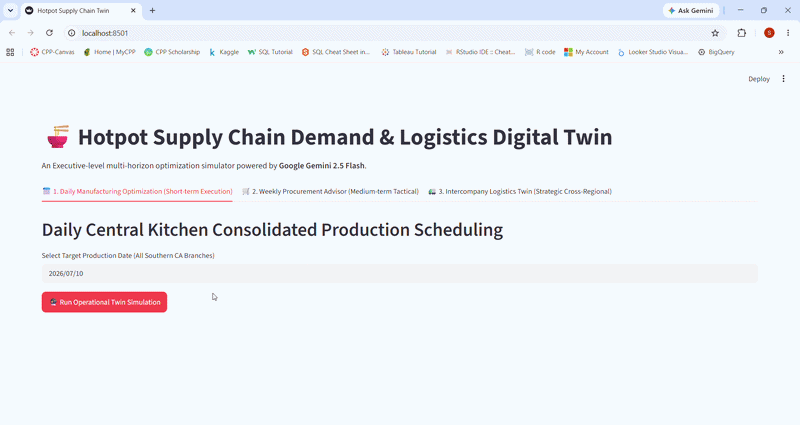
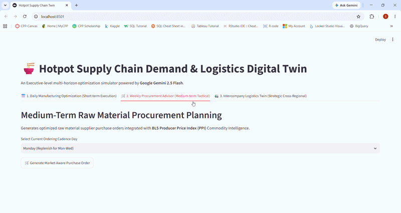
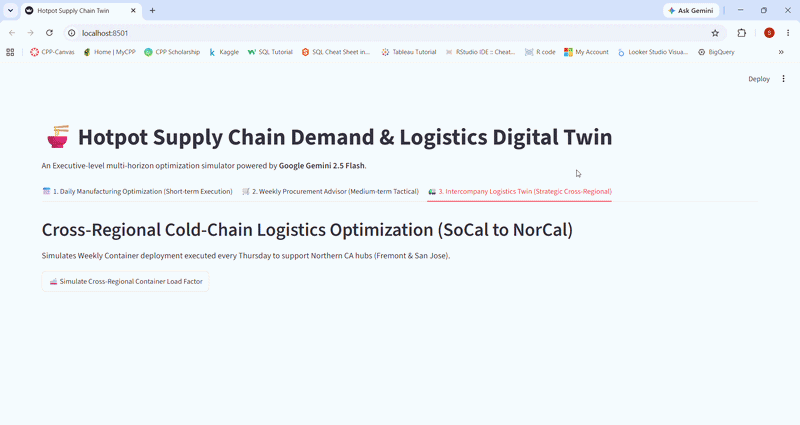

# Hotpot Supply Chain Demand & Logistics Digital Twin

An Executive-level multi-horizon optimization simulator powered by **Google Gemini 2.5 Flash** and **Streamlit**, designed to transform traditional multi-unit restaurant supply chain workflows into data-driven, automated operations.

---

## 🎓 Academic & Project Context
* **Purpose:** This repository is developed as a **Final Project** for the graduate course *TOM 6500: AI Studio & BUS Implementation* at California State Polytechnic University, Pomona (Cal Poly Pomona).
* **Objective:** To demonstrate how a **Digital Twin Framework** bridges the gap between historical operations, real-time external data (Weather APIs & Market Intelligence), and daily execution.

---

## ⚠️Disclaimer & Intellectual Property Note
* **Academic Case Study Only:** This project is a theoretical case study developed solely for educational purposes and portfolio demonstration. It does not represent a commercial software product.
* **Data Privacy:** All operational datasets, sales historical files (`sales_*.csv`), and backend algorithms are simulated based on public market patterns. No confidential, proprietary, or internal business data from any commercial entity was used.
* **Brand Acknowledgement:** Any references to "Hotpot" or specific hotpot restaurant operations are used strictly as a contextual framework. All trademarks belong to their respective legal owners. This project is entirely independent and is not endorsed by or affiliated with any commercial brand.

---

## Data Telemetry & Architecture Transparency
To maintain enterprise-grade compliance while operating within academic and API limits, the system operates on a dual-layer data telemetry structure:
* **Real-Time API Data (Dynamic):** Tab 1 dynamically calls the **Open-Meteo API** to fetch live/historical temperatures to drive demand modifiers. Tab 2 deploys a live **Gemini AI Market Scout Agent** to query real-time USDA California agricultural spot prices.
* **Simulated & Baseline Data:** Historical sales datasets are simulated to match multi-unit restaurant patterns. Macroeconomic trends in Tab 2 utilize actual historical data from the **U.S. Bureau of Labor Statistics (BLS)** for Fresh Vegetables (PPI Commodity Code 0113-02). Freight bidding in Tab 3 simulates a multi-drop long-haul route (SoCal CK ➔ NorCal Hubs ➔ Seattle Station), integrating carrier scorecard telemetry such as On-Time Delivery (OTD) rates and FSMA continuous temperature compliance metrics.

---

## Core Digital Twin Value Proposition: Current vs. Twin Workflow

Following standard Digital Twin architecture, this app was created to solve specific systemic friction points across three major operational horizons:

### Horizon 1: Daily Manufacturing & Production Scheduling (Tab 1)

#### Current Workflow & Business Bottlenecks:
* **Heuristic Forecasting:** Production leaders rely on rough, manual estimations to determine daily Napa Cabbage prep volumes, leading to high variance and waste.
* **Labor Friction & Inefficiencies:** To mitigate risk, workload is fragmented: the night shift pre-cuts a portion, and a dedicated morning shift worker must arrive **1 hour early** just to cut cabbage before the assembly line starts. 
* **Labor Cost & Constraint:** To avoid overtime (OT), this morning worker must leave early in the afternoon right after cleaning the vegetable washing machine. This creates a severe labor constraint, leaving them unavailable for other critical kitchen tasks.
* **Redundant Sanitation Maintenance:** Because different people cut cabbage across morning and night shifts, the industrial washing machine must be fully cleaned and sanitized **twice a day**, doubling maintenance labor and water usage.

#### How the Digital Twin Solves It:
* **Predictive Scheduling Optimization:** By correlating historical demand with real-time weather fluctuations (temperature drops drive hotpot sales), the twin provides high-accuracy production commands.
* **Workload Smoothing (Mudra):** Precision forecasting allows management to comfortably shift **100% of the cutting workload to the day before**. This eliminates the need for early morning shifts, prevents line stagnation, cuts out redundant machine cleaning cycles (from twice to once daily), and frees up afternoon labor for higher-value operational tasks.

---

### Horizon 2: Weekly Procurement & Market-Aware Sourcing (Tab 2)

#### Current Workflow & Business Bottlenecks:
* **Manual Inventory Audits:** Procurement staff must physically walk into the cold storage/refrigerator daily to check cabbage stock levels and estimate order quantities.
* **Siloed Communication:** Northern California (NorCal) Supply Chain managers manually place orders to Southern California (SoCal), requiring procurement teams to manually consolidate quantities on spreadsheets before placing orders with vendors.
* **Price Blindspots:** Sourcing managers lack immediate visibility into macro-inflation trends and local wholesale market fluctuations during contract negotiation.

#### How the Digital Twin Solves It:
* **Automated Consolidations:** The twin automatically aggregates multi-region multi-day demand look-aheads, generating an optimized Supplier Purchase Order (PO) in one click.
* **Dual-Layer Price Auditing:** Integrates a live **Gemini AI Market Scout** to capture current USDA spot prices alongside the **BLS Producer Price Index (PPI)** trend chart. Sourcing managers gain instant visibility into whether local farm quotes are fair, automatically triggering a 15% safety stock buffer if market volatility or inflation risks surge.

---

### Horizon 3: Intercompany Cold-Chain Logistics & Carrier Bidding (Tab 3)

#### Current Workflow & Business Bottlenecks:
* **Passive Order Fulfillment:** NorCal branches submit orders via email. A Central Kitchen leader must manually set aside and organize the allocated pallets into a reserve zone whenever they have free time, leading to dock clutter and potential cold-chain exposure.
* **Manual Freight Procurement:** Warehouse/Logistics manager spends hours emailing a fragmented pool of third-party trucking companies to manually solicit and bid out freight rates for Thursday linehaul dispatches.
* **Cube Utilization Blindspots:** No systematic visibility into the exact reefer container space/cube utilization rate prior to loading.

#### How the Digital Twin Solves It:
* **Live Freight Bidding Matrix:** The twin automatically deploys an AI agent to scout the market, instantly rendering a **Top 5 Lowest-Cost Compliant Carrier Bidding Matrix** based on true West Coast reefer freight indexes, securing the optimal rate (e.g., Polar Express) automatically.
* **Pallet & Cube Optimization:** Calculates precise 53ft Refrigerated Trailer space utilization percentages based on generated box counts and pallet dimensions. Management can visualize container capacity instantly, eliminating blindspots, protecting cold-chain integrity, and maximizing freight spend efficiency.

---

## Tech Stack & Installation

* **Frontend/UI:** Streamlit (Python-based interactive web framework)
* **AI/LLM Core:** Google GenAI SDK (`gemini-2.5-flash`)
* **Data Processing:** Pandas, NumPy, JSON, Requests (Rest APIs)

### Local Deployment Instructions
1. Clone this repository to your local directory.
2. Install dependencies: `pip install -r requirements.txt`
3. Open `app.py` and input your personal Google AI Studio Gemini API Key in the `GOOGLE_API_KEY` field.
4. Run the simulator: `streamlit run app.py`
